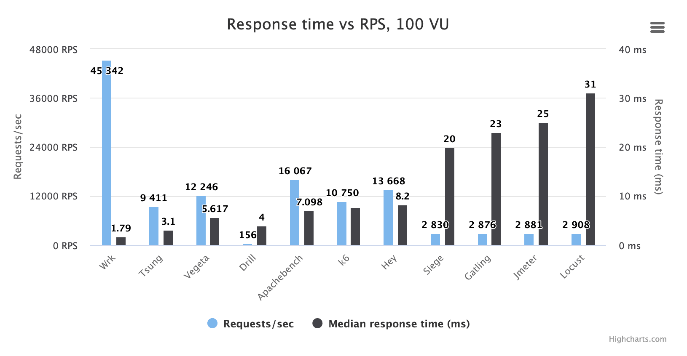

# Getting Started
Basic working example of different Load Testing Tools

## RTT vs RPS Comparison

## Table of Contents

1. [k6](./k6/README.md)
2. [wrk](./wrk/README.md)
3. [Locust](./locust/README.md)
