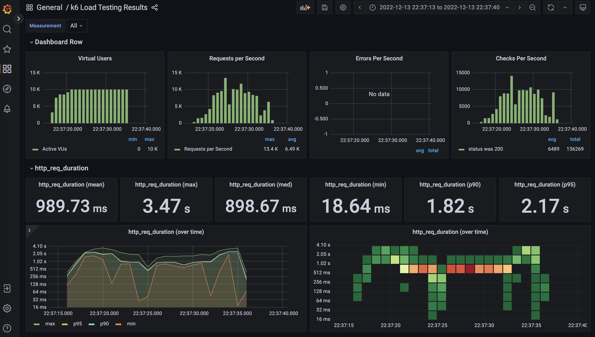

# Docs

- Official: [https://k6.io/](https://k6.io/)
- Documentation: [https://k6.io/docs/](https://k6.io/docs/)
- Github: [https://github.com/grafana/k6](https://github.com/grafana/k6)

# Commands

Run a quick test
- `docker run --rm -i grafana/k6 run --vus 5 --duration 10s - <script.js`

OR build the entire stack (including InfluxDB & Grafana)

- `docker-compose up`

# Access

[http://localhost:3000/d/k6/k6-load-testing-results?orgId=1&var-Measurement=All](http://localhost:3000/d/k6/k6-load-testing-results?orgId=1&var-Measurement=All)

# Examples

By using docker-compose:
- change the `k6` service command (`vus: 1000` / `duration: 20s`)

