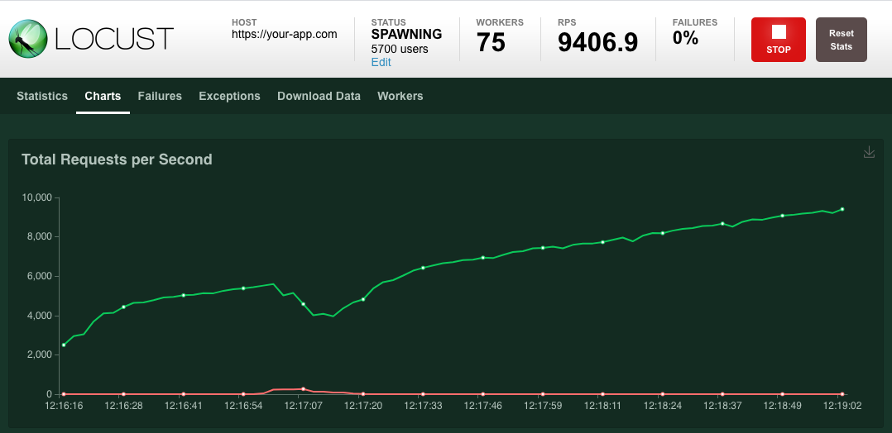
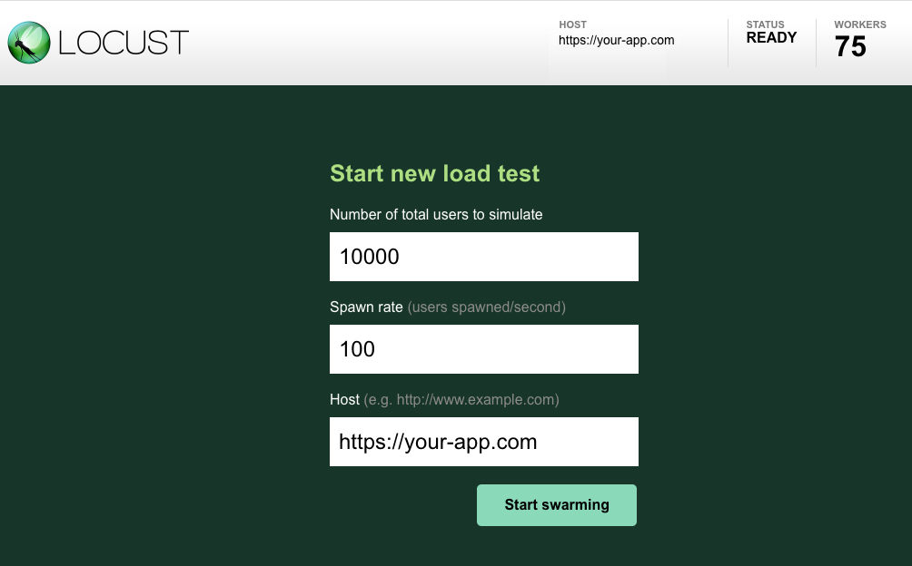
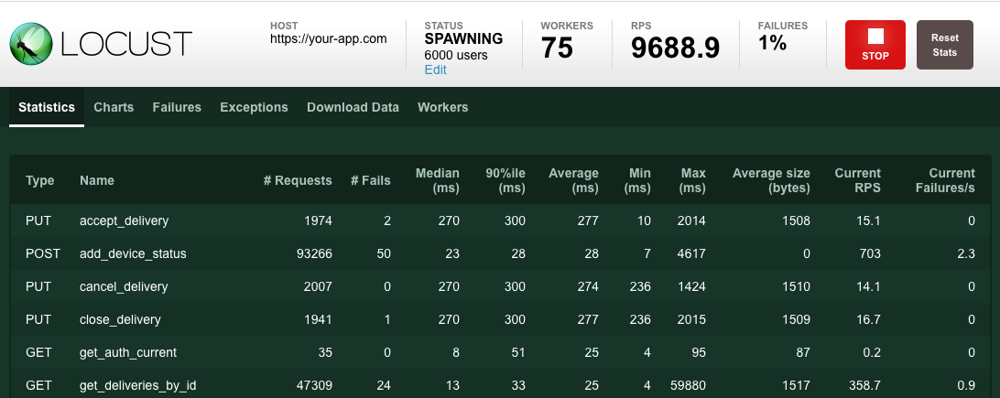
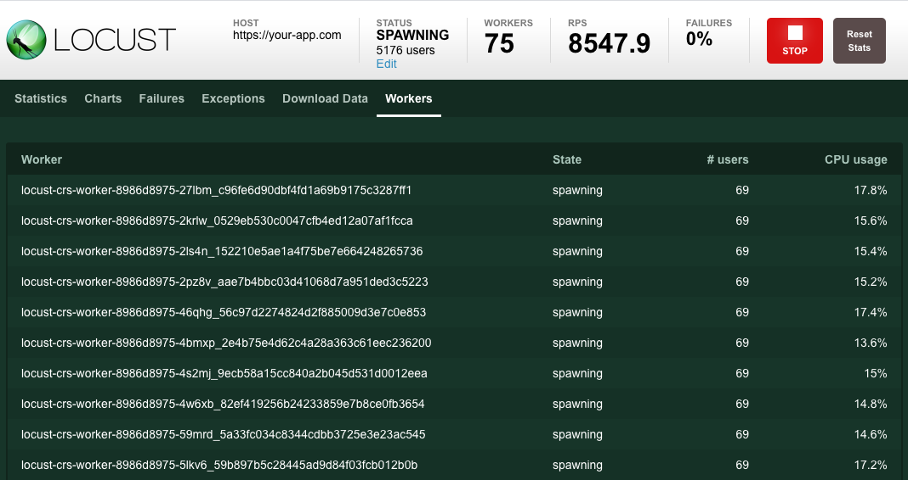

# Docs

- Official: [https://locust.io/](https://locust.io/)
- Documentation: [https://docs.locust.io/en/stable/](https://docs.locust.io/en/stable/)
- Github: [https://github.com/locustio/locust](https://github.com/locustio/locust)

# Commands

`docker-compose up --scale worker=8`

# Access

[http://localhost:8089/#](http://localhost:8089/#)

# Test Data

[http://app:3300](http://app:3300)

# Examples

