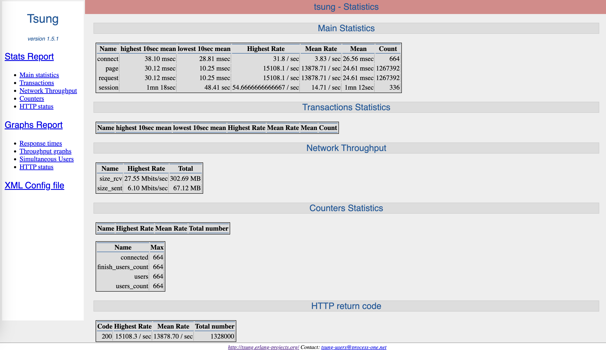

# Docs

- Official: [http://tsung.erlang-projects.org/](http://tsung.erlang-projects.org/)
- Documentation: [http://tsung.erlang-projects.org/user_manual/](http://tsung.erlang-projects.org/user_manual/)
- Github: [https://github.com/processone/tsung](https://github.com/processone/tsung)

# Commands

`docker-compose up`

# Test Data

[http://app:3300](http://app:3300)

# Examples

Change the `sample.xml` file (`arrivalphase` & `session`)

