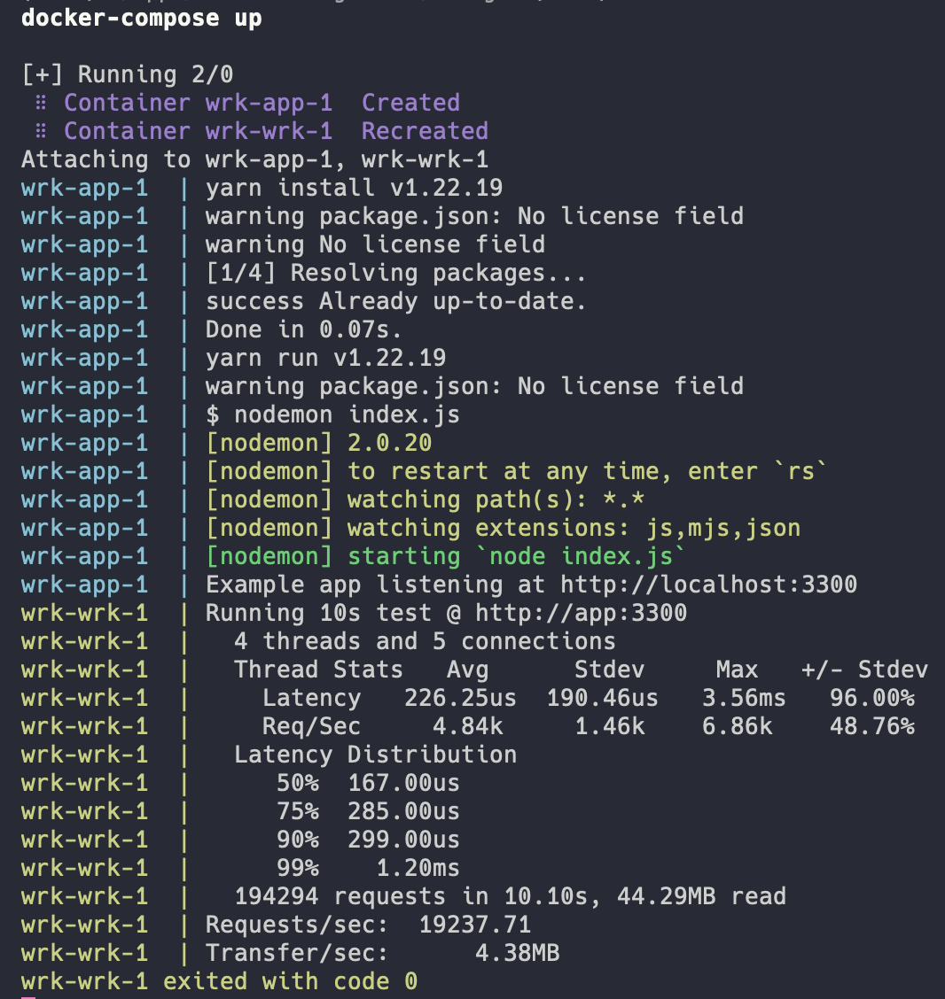

# Docs

- Github: [https://github.com/wg/wrk](https://github.com/wg/wrk)

# Commands

`docker-compose up`

# Test Data

[http://app:3300](http://app:3300)

# Examples

By using docker-compose:
- change the `wrk` service command (`-t 4 -c 5 -d 10s --latency http://app:3300`)

```
-c, --connections: total number of HTTP connections to keep open with
                   each thread handling N = connections/threads

-d, --duration:    duration of the test, e.g. 2s, 2m, 2h

-t, --threads:     total number of threads to use

-s, --script:      LuaJIT script, see SCRIPTING

-H, --header:      HTTP header to add to request, e.g. "User-Agent: wrk"

    --latency:     print detailed latency statistics

    --timeout:     record a timeout if a response is not received within
                   this amount of time.
```


